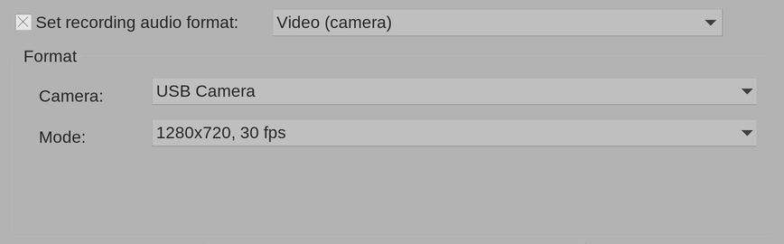
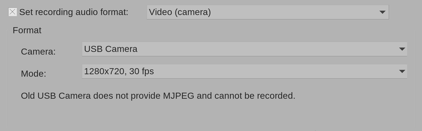
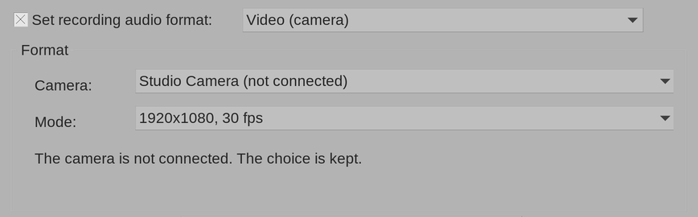

# Настройка камеры

Камеру и режим выбирают в окне **Track recording settings** дорожки, в рамке
«Format», когда выбран формат **Video (camera)** (как открыть окно — в
разделе [Первая запись](quick-start.md)).

Больше в этой рамке ничего нет: ни сдвига видео относительно звука, ни
калибровки. Синхронность расширение выдерживает само (см.
[Синхронность](sync.md)).

## Список камер

- В списке — камеры, которые видит система, под именами, которые она им даёт.
  У встроенных камер ноутбуков в системе обычно два устройства: для картинки
  и для служебных данных. В список попадает одна камера.
- Список составляется заново при каждом открытии окна. Подключили камеру —
  закройте окно настроек и откройте снова: она появится.
- Если камера ещё не выбрана, выбирается первая камера с MJPEG.

## Список режимов

Режим — это размер кадра и частота кадров, например «1280x720, 30 fps».
В списке — только режимы, в которых камера отдаёт MJPEG; самые крупные и
частые — сверху. Если камера ещё не выбрана, выбирается самый верхний режим.

Как выбрать:

- **Размер кадра.** Чем крупнее кадр, тем детальнее видео и тем больше файл:
  1280x720 занимает около 5 МБ в секунду, режимы меньше — меньше.
- **Частота кадров.** Видео в файле идёт ровно с выбранной частотой.

Видео записывается в выбранном режиме: при «1280x720, 30 fps» в файле будет
1280x720 с частотой 30 кадров в секунду.

## Пометки и сообщения

### Камера без MJPEG

Камера, которая MJPEG не отдаёт, стоит в списке с пометкой **(no MJPEG)**.
Выбрать её нельзя: список возвращается к прежней камере, а под ним
появляется объяснение.

### Камера не подключена

Если выбранной камеры сейчас нет в системе (отключена, выключена или
подключена к другому компьютеру), она остаётся в списке с пометкой **(not
connected)** и своим режимом. Выбор не теряется: подключите камеру и снова
поставьте дорожку на запись — она заработает без повторного выбора.

### Нет камер

- **No cameras found.** — система не видит ни одной камеры. Проверьте
  подключение и доступ к камере (см. [Установка](install.md#что-нужно)).
- **No camera provides MJPEG.** — камеры есть, но ни одна не отдаёт MJPEG.
- **Camera capture on Windows is not supported yet.** (или `on macOS`) —
  захват камер для этой системы пока не написан, и список пуст при любых
  камерах (см. [Установка](install.md#windows-и-macos)). Эта же строка стоит
  под списком, когда в проекте выбрана камера с Linux: сама камера остаётся в
  списке с пометкой «(not connected)».

Если закрыть окно, когда камера не выбрана, дорожка-камера всё равно
запишет видео — чёрное, и в консоли REAPER появится сообщение об этом.

## Где хранится выбор

Камера и режим хранятся вместе с дорожкой в проекте: при открытии проекта
всё восстанавливается. У каждой дорожки-камеры — свой выбор.

Камеру расширение узнаёт не по номеру устройства (`/dev/video0`,
`/dev/video1` — они меняются после перезагрузки), а по устойчивому имени,
которое ей даёт система: производитель, модель и серийный номер, если камера
его сообщает. Поэтому камеру можно переставлять в любой порт USB и
перезагружать компьютер — выбор остаётся верным.

Исключение — две одинаковые камеры без серийных номеров: по имени система их
не различает. Тогда расширение узнаёт одну из них по имени, а другую — по
порту USB, и после переподключения они могут поменяться местами. Такие
камеры подключайте всегда к одним и тем же портам и после подключения
проверяйте выбор в окне настроек.
