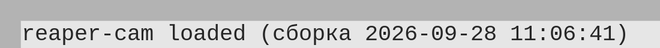

# Установка

## Что нужно

| Что | Зачем и какое |
|---|---|
| Linux | Пока расширение работает только на Linux. |
| REAPER 7 | Проверено на REAPER 7.80 для Linux (x86_64). |
| USB-камера с MJPEG | Любая обычная веб-камера USB (UVC), которая умеет отдавать MJPEG, — таких большинство, включая встроенные в ноутбуки. Камеры, которые отдают только несжатую картинку, не поддерживаются. |
| Видео в REAPER | Чтобы смотреть записанное видео в REAPER, в системе нужны библиотеки FFmpeg: REAPER на Linux показывает видео через них. Обычно они ставятся пакетом `ffmpeg`. |
| Место на диске | Около 5 МБ в секунду при 1280x720 — порядка 18 ГБ на час записи (подробнее — в разделе [Запись](recording.md#сколько-места-занимает-видео)). |

Доступ к камере. Программы получают камеру через устройство `/dev/video*`.
В обычном настольном Linux доступ к нему у пользователя есть сразу. Если
камера не видна ни в одной программе, проверьте, что пользователь входит в
группу `video`.

## Как поставить

1. Закройте REAPER.
2. Скопируйте файл расширения `reaper_cam.so` в папку `UserPlugins` папки
   ресурсов REAPER. Обычно это `~/.config/REAPER/UserPlugins/`. Если папки
   нет — создайте её.
3. Запустите REAPER.

Если готового файла `reaper_cam.so` у вас нет, его собирают из исходников
проекта. Нужны компилятор C++, CMake и Ninja; в папке проекта выполните:

```sh
cmake --preset default
cmake --build --preset default
cmake --install build
```

Последняя команда сама кладёт `reaper_cam.so` в `~/.config/REAPER/UserPlugins/`.

## Как проверить, что расширение загрузилось

При запуске REAPER расширение пишет строку в консоль REAPER (окно «ReaScript
console output»):



В скобках — дата и время сборки: по ним видно, какая версия загружена.

Второй признак — в списке форматов записи дорожки появился «Video (camera)»
(как его найти — в разделе [Первая запись](quick-start.md)).

## Обновление

Закройте REAPER, замените файл `reaper_cam.so` новым и запустите REAPER
снова. Настройки дорожек-камер хранятся в проектах и после обновления
остаются.

## Удаление

Закройте REAPER и удалите файл `UserPlugins/reaper_cam.so`. Записанные видео
остаются обычными файлами MOV и открываются в REAPER и других программах и
без расширения. А вот записывать дорожками-камерами без расширения REAPER не
сможет: формата «Video (camera)» он не знает.
