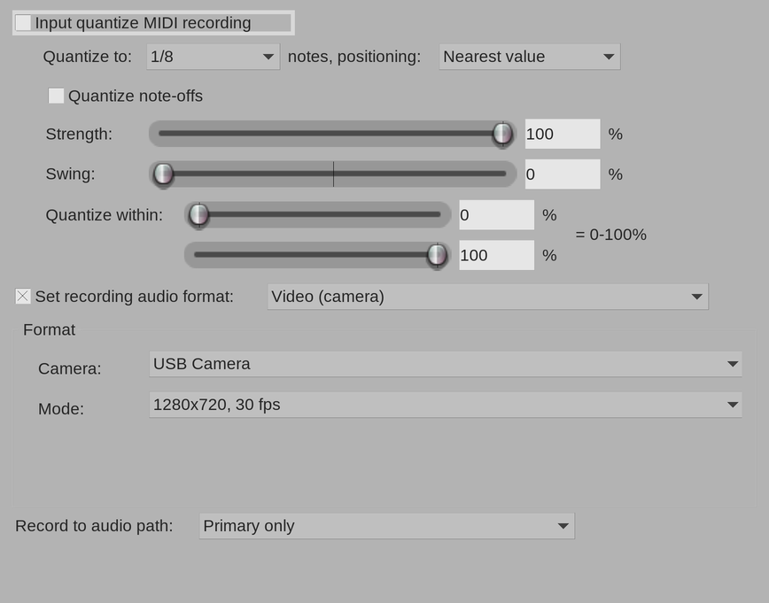
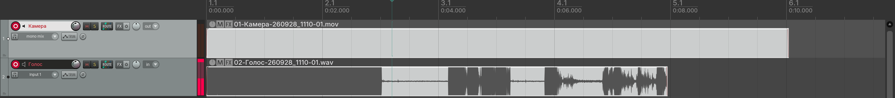
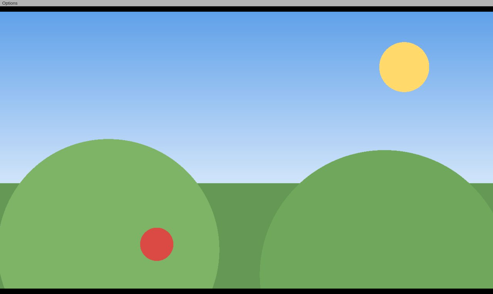

# Первая запись

Пример: вы поёте под минусовку и хотите снять себя на камеру. В проекте две
дорожки: «Голос» пишет микрофон, «Камера» — видео.

## 1. Создайте дорожку для камеры

Добавьте в проект обычную дорожку (Track → Insert new track) и назовите её,
например, «Камера». Вход дорожки выбирать не нужно: звук она не записывает.

## 2. Откройте настройки записи дорожки

Щёлкните правой кнопкой мыши по кнопке записи дорожки (красный кружок) и
выберите **Track recording settings (Input Quantize, Format, etc)...**

То же окно открывает действие «Track: View track recording settings (MIDI
quantize, file format/path) for last touched track» из списка действий
(Actions → Show action list).

## 3. Выберите формат «Video (camera)»

1. Поставьте галочку **Set recording audio format**.
2. В списке справа от неё выберите **Video (camera)**.
3. Ниже, в рамке «Format», появятся два списка:
   - **Camera** — камера;
   - **Mode** — размер кадра и частота кадров.

Если камера одна, она уже выбрана вместе с самым крупным режимом — обычно
ничего менять не нужно. Про выбор камеры и режима подробно — в разделе
[Настройка камеры](camera-settings.md).

## 4. Закройте окно настроек

Кнопки OK в этом окне нет: REAPER сохраняет выбор, когда окно закрывается —
по крестику или когда вы щёлкаете в другом месте. Выбор хранится вместе с
дорожкой в проекте.

## 5. Поставьте дорожки на запись

Нажмите кнопку записи на дорожке «Камера» и, как обычно, на дорожке «Голос».

В момент постановки на запись расширение включает камеру (на камере
загорается индикатор) и само переводит дорожку-камеру в режим «Record: output
(mono)» с выключенным мониторингом: на дорожке видно «out» и «mono mix». Так
и должно быть — трогать это не нужно.

Нажимайте Record не сразу, а через секунду-другую после постановки на
запись: камере нужно время, чтобы включиться. Если начать запись мгновенно,
первые кадры могут быть чёрными.

## 6. Запишите

Нажмите Record, спойте, нажмите Stop. На дорожке «Камера» появится
видео-айтем, на дорожке «Голос» — звуковой:

Видео-айтем может оказаться длиннее звукового. Это нормально: REAPER сдвигает
запись со входа звуковой карты на задержку ввода и отрезает столько же в
конце, а видео не обрезается. Подробнее — в разделе
[Запись](recording.md#почему-видео-айтем-длиннее-звукового).

## 7. Посмотрите видео

Откройте окно видео REAPER: меню View → Video или действие «Video: Show/hide
video window» (обычно Ctrl+Shift+V). Окно показывает кадр в позиции курсора и
при воспроизведении — видео вместе со звуком.

*На снимке вместо изображения камеры — нарисованная сцена.*

## 8. Когда камера больше не нужна

Снимите дорожку-камеру с записи — камера выключится, и её снова смогут
использовать другие программы (браузер, видеозвонки). Пока дорожка-камера
стоит на записи, камера занята REAPER.
