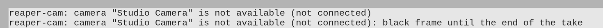

# Сообщения и неполадки

## Сообщения в консоли REAPER

Расширение сообщает о проблемах в консоли REAPER — окне «ReaScript console
output», которое открывается само. Каждое сообщение начинается с
`reaper-cam:`, в кавычках — имя камеры из настроек дорожки.

### Камера недоступна

`camera "Имя" is not available (причина)`

Появляется при постановке дорожки-камеры на запись, если камеру не удалось
включить. Запись при этом возможна, но видео будет чёрным.

`camera "Имя" is not available (причина): black frame until the end of the take`

Появляется во время записи: камера недоступна с самого начала дубля или
пропала посреди него. Видео до конца дубля чёрное, звук пишется как обычно.
Такое сообщение — одно на дубль.

Причины в скобках:

| Причина | Что случилось | Что делать |
|---|---|---|
| `busy` | Камеру держит другая программа: браузер, видеозвонок, OBS, другой экземпляр REAPER. | Закройте камеру в той программе, затем снимите дорожку-камеру с записи и поставьте снова. |
| `not connected` | Выбранной камеры нет в системе. | Подключите камеру и снова поставьте дорожку на запись. Если у вас две одинаковые камеры без серийных номеров — подключите каждую к тому же порту USB, что и раньше (см. [Настройка камеры](camera-settings.md#где-хранится-выбор)). |
| `no first frame` | Камера открылась, но не прислала ни одного кадра за 3 секунды. | Переподключите камеру; проверьте её в другой программе. |
| `no frames` | Камера перестала присылать кадры больше чем на секунду. | Проверьте кабель и порт USB; переподключите камеру и поставьте дорожку на запись снова. |
| `mode not accepted` | Камера не приняла выбранный режим. | Выберите другой режим в настройках дорожки. |
| `capture is not supported on Windows` (или `on macOS`) | Проект с камерой записан на Linux и открыт на системе, где захвата камер пока нет. | Запишите видео на Linux; здесь дорожка-камера пишет чёрное видео (см. [Установка](install.md#windows-и-macos)). |
| `device error`, `cannot open`, `cannot start`, `cannot get buffers`, `cannot map buffers`, `cannot queue buffers`, `poll` | Ошибка устройства: камеру отключили во время работы или драйвер отказал. | Переподключите камеру и поставьте дорожку на запись снова. |

Повторная постановка на запись и нажатие Record сами пробуют включить
камеру ещё раз.

### Камера не выбрана

`camera is not selected: the take is black`

У дорожки-камеры формат «Video (camera)», но камера в настройках не выбрана
(например, камер в системе не было). Видео записывается чёрным. Выберите
камеру в настройках записи дорожки (см. [Настройка камеры](camera-settings.md)).

### Ошибки файла

`cannot create video file: …`

Файл видео не удалось создать: нет папки для записи, нет прав на запись или
места на диске. REAPER в этом случае не начинает запись вовсе и показывает
своё окно ошибки «Can't write to recording files». Проверьте путь для
записанных файлов в настройках проекта и свободное место.

`video recording stopped: …`

Запись видео прервалась посреди дубля, обычно из-за нехватки места на диске.
Уже записанное остаётся в файле.

`video file was not finished: …`

Файл не удалось правильно закрыть после записи, обычно из-за нехватки места.
Файл может быть неполным.

### Строки при запуске

`reaper-cam 0.1.0 loaded (сборка …)`

Не ошибка: расширение загрузилось. Число — версия расширения, в скобках —
дата и время сборки.

`Camera capture on Windows is not supported yet. Camera tracks record black video.`

Только на Windows и macOS: захвата камер для этих систем пока нет.
Расширение работает, но дорожки-камеры записывают чёрное видео (см.
[Установка](install.md#windows-и-macos)).

## Частые вопросы

**В списке форматов нет «Video (camera)».**
Расширение не загрузилось. Проверьте, что файл расширения для вашей системы
лежит в папке `UserPlugins` (на Linux — `reaper_cam.so` в
`~/.config/REAPER/UserPlugins/`), и перезапустите REAPER; при загрузке в
консоли появляется строка `reaper-cam … loaded` (см. [Установка](install.md)).
На macOS проверьте ещё, что с файла снята пометка «скачано из интернета» (см.
[Установка](install.md#как-поставить)).

**В списке камер пусто, а под ним «Camera capture on … is not supported yet.»**
Это Windows или macOS: захвата камер для них пока нет (см.
[Установка](install.md#windows-и-macos)).

**В списке камер пусто («No cameras found.»).**
Система не видит камеру: проверьте подключение, проверьте, что камера
работает в другой программе, и что у пользователя есть доступ к `/dev/video*`
(группа `video`).

**Моей камеры нет в списке, хотя она подключена.**
Если камера не отдаёт MJPEG, она есть в списке с пометкой «(no MJPEG)», но
выбрать её нельзя — записывать её расширение не умеет. Служебные устройства
камер (например, для метаданных) в список не попадают специально.

**Видео-айтем чёрный.**
Во время записи камера была недоступна — в консоли есть сообщение с
причиной. Другая частая причина — нажали Record сразу после постановки на
запись: камера не успела включиться, и тогда чёрные только первые кадры.

**Видео-айтем есть, но окно видео ничего не показывает.**
REAPER на Linux показывает видео через библиотеки FFmpeg — установите пакет
`ffmpeg` и перезапустите REAPER. Проверьте также, что окно видео открыто (View
→ Video) и курсор стоит внутри видео-айтема.

**Индикатор камеры горит, хотя я ничего не записываю.**
Дорожка-камера стоит на записи: так камера готова к записи без задержки.
Снимите дорожку с записи — камера выключится.

**Браузер или программа видеозвонков не видят камеру.**
Пока дорожка-камера стоит на записи, камера занята REAPER. Снимите дорожку с
записи.

**Видео дёргается в темноте.**
Камера сама снизила частоту кадров. См. [Синхронность](sync.md#плохое-освещение).

**Видео-айтем длиннее звукового.**
Так и должно быть: REAPER отрезает от звука со входа хвост длиной в задержку
ввода, а от видео — нет. См. [Запись](recording.md#почему-видео-айтем-длиннее-звукового).

**Я поменял режим записи дорожки-камеры, а он вернулся к «output (mono)».**
Расширение ставит этот режим при каждой постановке на запись: в других
режимах REAPER сдвигает записанное на задержки или требует вход звуковой
карты.

**На двух дорожках одна камера, а размер кадра на второй не тот, что я
выбрал.**
Камера работает в одном режиме — в том, с которым её включила первая
дорожка. Выберите обеим дорожкам одинаковый режим.

**Файлы получаются огромными.**
Кадры сохраняются без пережатия: при 1280x720 это около 18 ГБ в час.
Выберите режим с меньшим кадром или пережмите готовое видео другой
программой. См. [Запись](recording.md#сколько-места-занимает-видео).
